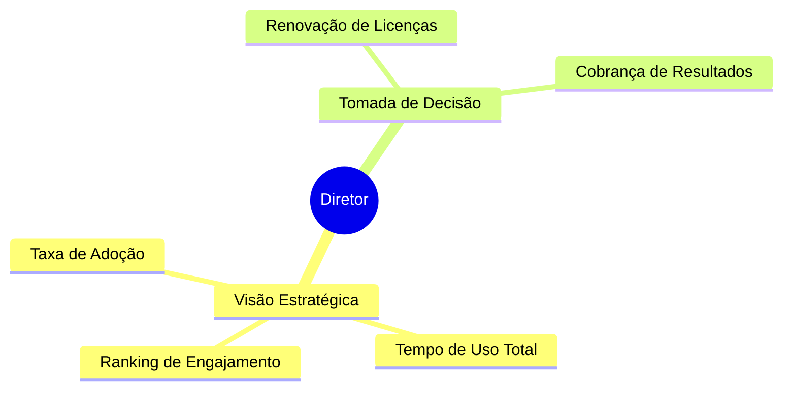

import DirectorIcon from '@site/static/img/icons/director.svg';

# <DirectorIcon width="36" style={{verticalAlign: 'middle', marginRight: '10px'}} /> Diretor Escolar

O Diretor utiliza a plataforma para ter uma visão macro do investimento em tecnologia. Ele está menos preocupado com "qual jogo foi jogado" e mais com "a escola está usando a ferramenta pela qual pagamos?".

---

## Quem é

| | |
|---|---|
| **Perfil** | Diretor(a) Geral ou Mantenedor |
| **Onde atua** | Diretoria |
| **Experiência digital** | Básica |
| **Frequência de uso** | Mensal / Sob demanda |

> *"Quero saber se o investimento no Educacross está sendo justificado pelo uso dos alunos e professores."*

---

## O que faz no Educacross

---

## Principais ações

| Ação | Descrição | Frequência |
|------|-----------|------------|
| **Relatório de Acessos** | Verifica quantos alunos únicos acessaram a plataforma | Mensal |
| **Visão Geral da Escola** | Dashboard macro de tempo jogado e questões resolvidas | Mensal |

---

## Jornadas relacionadas

- [Relatório de Acessos](../journeys/director/student-access-report)

