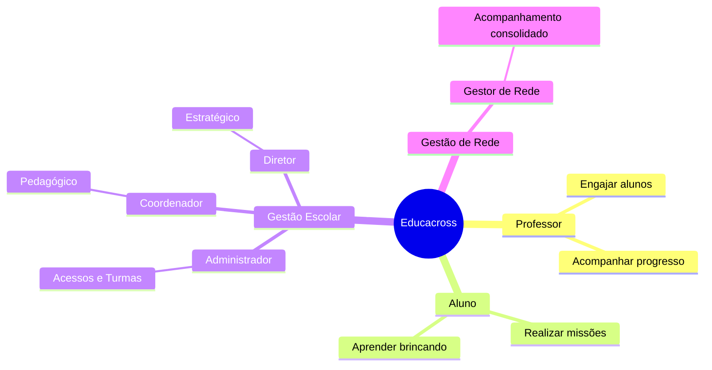

import TeacherIcon from '@site/static/img/icons/teacher.svg';
import StudentIcon from '@site/static/img/icons/student.svg';
import AdminIcon from '@site/static/img/icons/admin.svg';
import CoordinatorIcon from '@site/static/img/icons/coordinator.svg';
import DirectorIcon from '@site/static/img/icons/director.svg';

# Personas

O Educacross é projetado para atender diversos perfis de usuários em diferentes níveis da hierarquia educacional.

## Visão Geral

---

## Perfis de Usuário

### [<TeacherIcon width="24" style={{verticalAlign: 'middle', marginRight: '5px'}} /> Professor](./professor)
O protagonista em sala de aula. Responsável por selecionar o conteúdo (missões/jogos) e acompanhar o desenvolvimento dos alunos no dia a dia.

### [<StudentIcon width="24" style={{verticalAlign: 'middle', marginRight: '5px'}} /> Aluno](./aluno)
O usuário final. Utiliza a plataforma para aprender matemática e letramento de forma lúdica e gamificada.

### [<AdminIcon width="24" style={{verticalAlign: 'middle', marginRight: '5px'}} /> Administrador](./administrator)
O braço operacional. Responsável por cadastros, senhas, enturmação e garantia de que todos conseguem acessar o sistema.

### [<CoordinatorIcon width="24" style={{verticalAlign: 'middle', marginRight: '5px'}} /> Coordenador](./coordinator)
O apoio pedagógico. Monitora se a metodologia está sendo aplicada, analisa relatórios de aprendizagem e orienta professores.

### [<DirectorIcon width="24" style={{verticalAlign: 'middle', marginRight: '5px'}} /> Diretor](./director)
O gestor estratégico da unidade. Acompanha indicadores macro de uso e retorno sobre o investimento (ROI).

### [ Gestor de Rede](./network-manager)
A visão consolidada. Acompanha o desempenho de múltiplas escolas de uma rede (privada ou pública) para identificar pontos de atenção.

---

import { IconCheck } from '@site/src/components/StatusIcons';

## Matriz de Responsabilidades

| Responsabilidade | Professor | Admin | Coord | Diretor | Rede |
|------------------|:---------:|:-----:|:-----:|:-------:|:----:|
| Encarregar Missões | <IconCheck size={14} /> | | | | |
| Jogar (Gamificação) | | | | | | (Só Aluno) |
| Criar/Editar Turmas | | <IconCheck size={14} /> | | | |
| Aprovar Cadastros | | <IconCheck size={14} /> | | | |
| Relatórios Pedagógicos | <IconCheck size={14} /> | | <IconCheck size={14} /> | | |
| Relatórios de Acesso | | | | <IconCheck size={14} /> | <IconCheck size={14} /> |
| Visão Multi-escola | | | | | <IconCheck size={14} /> |
