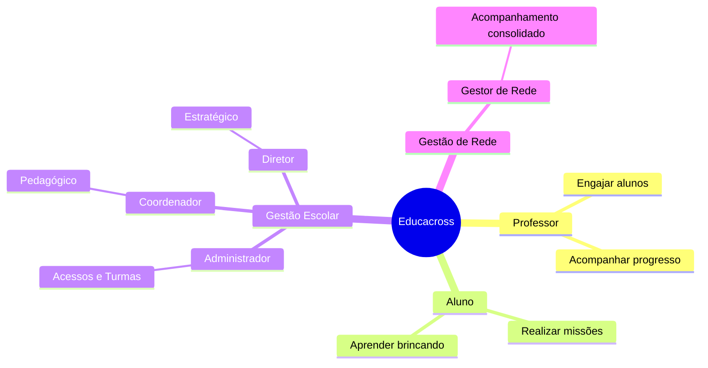

# Personas

O Educacross é projetado para atender diversos perfis de usuários em diferentes níveis da hierarquia educacional.

## Visão Geral

---

## Perfis de Usuário

### [👨‍🏫 Professor](./professor)
O protagonista em sala de aula. Responsável por selecionar o conteúdo (missões/jogos) e acompanhar o desenvolvimento dos alunos no dia a dia.

### [👨‍🎓 Aluno](./aluno)
O usuário final. Utiliza a plataforma para aprender matemática e letramento de forma lúdica e gamificada.

### [🛠️ Administrador](./administrator)
O braço operacional. Responsável por cadastros, senhas, enturmação e garantia de que todos conseguem acessar o sistema.

### [👩‍🏫 Coordenador](./coordinator)
O apoio pedagógico. Monitora se a metodologia está sendo aplicada, analisa relatórios de aprendizagem e orienta professores.

### [👔 Diretor](./director)
O gestor estratégico da unidade. Acompanha indicadores macro de uso e retorno sobre o investimento (ROI).

### [🌐 Gestor de Rede](./network-manager)
A visão consolidada. Acompanha o desempenho de múltiplas escolas de uma rede (privada ou pública) para identificar pontos de atenção.

---

## Matriz de Responsabilidades

| Responsabilidade | Professor | Admin | Coord | Diretor | Rede |
|------------------|:---------:|:-----:|:-----:|:-------:|:----:|
| Encarregar Missões | ✅ | | | | |
| Jogar (Gamificação) | | | | | | (Só Aluno) |
| Criar/Editar Turmas | | ✅ | | | |
| Aprovar Cadastros | | ✅ | | | |
| Relatórios Pedagógicos | ✅ | | ✅ | | |
| Relatórios de Acesso | | | | ✅ | ✅ |
| Visão Multi-escola | | | | | ✅ |
