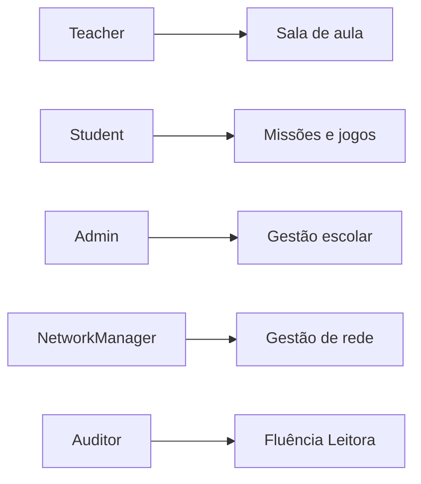

import { IconTeacher, IconStudent, IconAdmin, IconCoordinator, IconDirector, IconCheck, IconNetworkManager } from '@site/src/components/MaterialIcon';

# Personas

O Educacross atende diferentes perfis de usuários. As **roles com navegação própria** no sistema são 5: `Teacher`, `Student`, `Admin`, `NetworkManager` e `Auditor`. Coordenador e Diretor são tipos de usuário gerenciados pelo Admin.

## Roles com navegação própria

---

## Perfis de Usuário

### [<IconTeacher size={24} /> Professor](./professor)
Role `Teacher`. Cria missões, acompanha turmas, gera relatórios e aplica avaliações.

### [<IconStudent size={24} /> Aluno](./aluno)
Role `Student`. Acessa missões liberadas, Sistema de Ensino, Treinos da Família e High Five.

### [<IconAdmin size={24} /> Administrador](./administrator)
Role `Admin`. Gerencia toda a escola: cadastros, relatórios, avaliações, eventos e módulos.

### [<IconNetworkManager size={24} /> Gestor de Rede](./network-manager)
Role `NetworkManager`. Mesmas capacidades do Admin, com visão multi-escola e transferência de alunos entre unidades.

### [Auditor](./auditor)
Role `Auditor`. Acesso restrito a **Avaliações → Fluência Leitora**.

---

## Tipos de usuário (gerenciados pelo Admin)

### [<IconCoordinator size={24} /> Coordenador](./coordinator)
Cadastrado pelo Admin (Cadastros → Coordenadores). Sem navigation file própria — acessa o sistema no escopo Admin com permissões restritas.

### [<IconDirector size={24} /> Diretor](./director)
Cadastrado pelo Admin (Cadastros → Diretores). Sem navigation file própria — acessa o sistema no escopo Admin com permissões restritas.

---

## Matriz de Responsabilidades

| Responsabilidade | Professor | Admin | Coord | Diretor | Rede |
|------------------|:---------:|:-----:|:-----:|:-------:|:----:|
| Encarregar Missões | <IconCheck size={14} /> | | | | |
| Jogar (Gamificação) | | | | | | (Só Aluno) |
| Criar/Editar Turmas | | <IconCheck size={14} /> | | | |
| Aprovar Cadastros | | <IconCheck size={14} /> | | | |
| Relatórios Pedagógicos | <IconCheck size={14} /> | | <IconCheck size={14} /> | | |
| Relatórios de Acesso | | | | <IconCheck size={14} /> | <IconCheck size={14} /> |
| Visão Multi-escola | | | | | <IconCheck size={14} /> |
