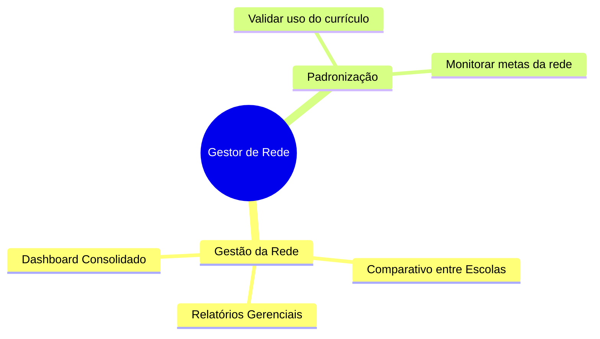

#  Gestor de Rede

O Gestor de Rede (Secretarias de Educação ou Redes de Ensino Privadas) acessa dados consolidados. Ele não gerencia alunos individualmente, mas sim o desempenho comparativo entre unidades escolares.

---

## Quem é

| | |
|---|---|
| **Perfil** | Gestor de Tecnologia Educacional / Superintendente |
| **Onde atua** | Secretaria de Educação / Matriz |
| **Experiência digital** | Intermediária a Avançada |
| **Frequência de uso** | Semanal / Mensal |

> *"Preciso identificar quais escolas da rede estão com baixo engajamento para direcionar formação."*

---

## O que faz no Educacross

---

## Principais ações

| Ação | Descrição | Importância |
|------|-----------|------------|
| **Dashboard de Rede** | Visualiza métricas agregadas (Total de Alunos, Escolas Ativas) | Alta |
| **Comparativo de Escolas** | Identifica escolas "Campeãs" e escolas "Em Risco" | Alta |
| **Exportação de Dados** | Extrai bases para BI próprio da secretaria | Média |

---

## Jornadas relacionadas

- [Gestão de Rede](../journeys/network-manager/network-management)

