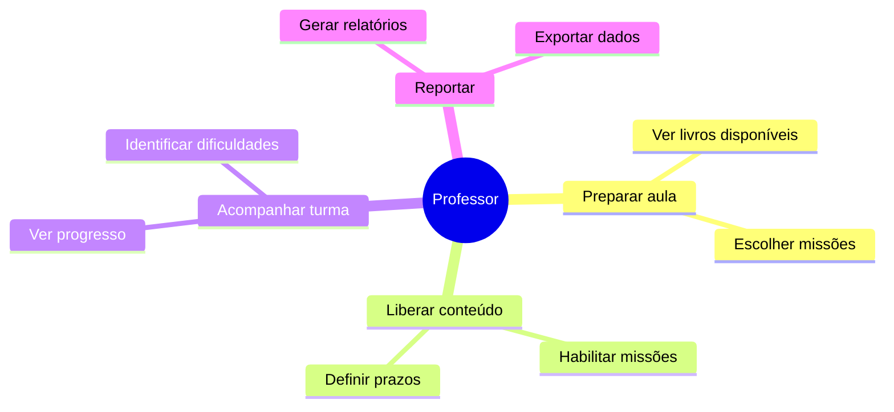

import { IconTeacher } from '@site/src/components/MaterialIcon';

# <IconTeacher size={28} /> Professor

O professor é o principal usuário ativo do Educacross. Ele utiliza a plataforma para **engajar seus alunos** em atividades educacionais gamificadas e **acompanhar o progresso** da turma.

---

## Quem é

| | |
|---|---|
| **Perfil** | Educador de ensino fundamental (1º ao 9º ano) |
| **Onde atua** | Escolas públicas e particulares |
| **Experiência digital** | Intermediária — usa WhatsApp, Google Classroom |
| **Frequência de uso** | Diária |

> *"Preciso de ferramentas que me ajudem a engajar os alunos sem criar mais trabalho para mim."*

---

## O que faz no Educacross

---

## Principais ações

| Ação | Descrição | Frequência |
|------|-----------|------------|
| **Visualizar Livros** | Navega pelos livros do sistema de ensino | Diária |
| **Habilitar Missões** | Libera atividades para os alunos realizarem | Diária |
| **Ver Dashboard** | Acompanha o progresso geral da turma | Diária |
| **Gerar Relatórios** | Cria relatórios de desempenho para coordenação | Semanal/Mensal |

---

## Jornadas relacionadas

- [Visualizar Livros do Sistema](../journeys/teacher/education-system-books)
- [Habilitar Missões](../fluxos/habilitar-missoes)
- [Jornadas do Professor](../journeys/teacher/)

---

## Telas principais

| Tela | Função |
|------|--------|
| Dashboard da Turma | Visão geral do progresso |
| Livros do Sistema | Catálogo de conteúdos |
| Lista de Missões | Gerenciar habilitações |
| Relatórios | Exportar dados de desempenho |

