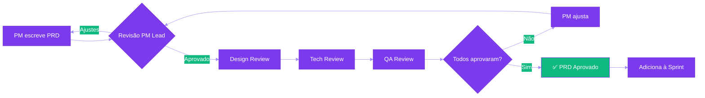

# 📋 Product Requirements Documents (PRDs)

Documentos de especificação de features e funcionalidades do produto.

:::info O Que é um PRD?
Um **Product Requirements Document (PRD)** é o blueprint de uma feature. Ele documenta:
- **O problema** que estamos resolvendo
- **Para quem** estamos resolvendo
- **Como** vamos resolver (solução proposta)
- **Por que agora** (priorização)
- **Como medimos sucesso** (métricas)
:::

---

## 🚀 Como Usar

### Para Product Managers
1. Use o [Template PRD](./template.md) para documentar novas features
2. Circule com stakeholders (design, tech, QA) para revisão
3. Marque como "Aprovado" quando todos concordarem
4. Mantenha atualizado durante desenvolvimento

### Para Desenvolvedores
- PRDs são a fonte de verdade de **o quê** construir
- Leia antes de estimar esforço
- Use "Requisitos Funcionais" e "Critérios de Aceitação" para guiar implementação

### Para Designers
- PRDs definem **problema e personas** antes do design
- Use seção "Fluxo de Usuário" para alinhar com PM
- "Considerações de Design" lista princípios e constraints

---

## 📚 Template e Exemplos

  

    
📝

    

      <h3>Template PRD</h3>
      
Use este template para criar novos PRDs

      <a href="./template" className="card-link">
        Ver Template arrow_forward
      </a>
    

  

  

    
🎯

    

      <h3>Exemplo: Missões Custom</h3>
      
PRD de referência para criação de missões personalizadas

      <a href="#" className="card-link">
        Em breve schedule
      </a>
    

  

  

    
📊

    

      <h3>Exemplo: Dashboard de Performance</h3>
      
PRD de referência para dashboards de dados

      <a href="#" className="card-link">
        Em breve schedule
      </a>
    

  

---

## 📋 Lista de PRDs

### 🚧 Em Desenvolvimento

_Nenhum PRD em desenvolvimento no momento_

---

### ✅ Lançados

_Adicione PRDs aqui após lançamento das features_

---

### 📌 Backlog

_Adicione PRDs planejados aqui_

---

## 🔗 Recursos Relacionados

- [**Regras de Negócio**](../business-rules/) - Restrições e lógica do produto
- [**Product Decision Records**](../decisions/) - Decisões de produto documentadas
- [**Jornadas de Usuário**](../journeys/) - Fluxos atuais e futuros
- [**Product Vision & Strategy**](../product-strategy/vision.md) - Direção estratégica

---

## 🎓 Boas Práticas

:::tip Dicas para Escrever PRDs Eficazes

### 1. Comece pelo Problema, Não pela Solução
❌ "Vamos adicionar um botão de busca na barra superior"  
✅ "Professores gastam 5 minutos navegando para encontrar uma missão específica"

### 2. Use Dados, Não Opiniões
❌ "Usuários vão adorar isso"  
✅ "78% dos professores entrevistados citaram isso como pain point crítico"

### 3. Defina Critérios de Sucesso Mensuráveis
❌ "Melhorar experiência do usuário"  
✅ "Reduzir tempo de criação de missões de 30min para 10min (p50)"

### 4. Seja Claro sobre Fora do Escopo
Documente explicitamente o que **NÃO** será feito nesta versão.  
Isso evita scope creep e expectativas desalinhadas.

### 5. Mantenha Atualizado
PRD não é "write-once". Atualize conforme aprendemos durante desenvolvimento.

:::

---

## 📊 Métricas de Qualidade dos PRDs

| Métrica | Meta | Atual |
|---------|------|-------|
| **Time to Approval** | < 5 dias | - |
| **PRDs revisados por stakeholders** | 100% | - |
| **Features lançadas on-time** | > 80% | - |
| **Retrabalho por requisitos mal definidos** | < 10% | - |

---

## 🤝 Processo de Revisão

**SLA de Revisão:**
- PM Lead: 1 dia útil
- Design: 2 dias úteis
- Tech: 2 dias úteis
- QA: 1 dia útil

**Total esperado:** 5 dias úteis from draft to approval

---

## 📞 Contato

**Dúvidas sobre PRDs?**  
Entre em contato com o Time de Produto.

---

**Última atualização:** Fevereiro 2026  
**Mantido por:** Time de Produto
