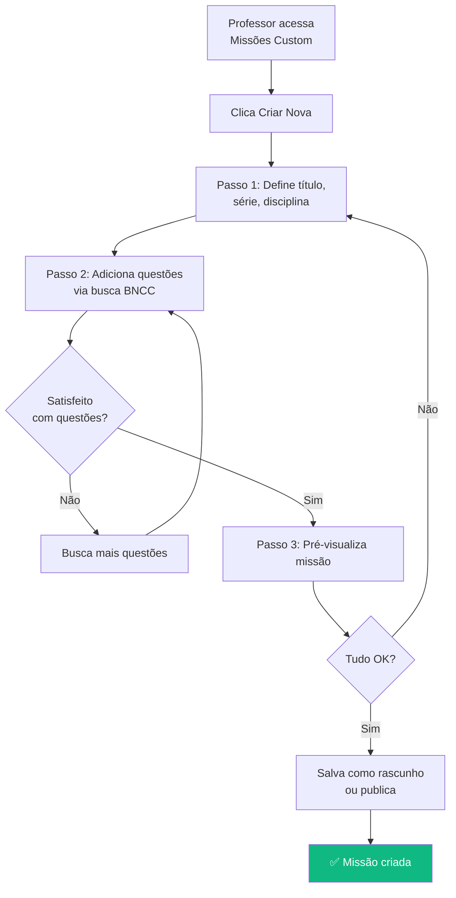

import { IconCheck, IconWarning, IconConstruction, PriorityHigh, PriorityMedium, PriorityLow } from '@site/src/components/StatusIcons';

# PRD Template - Product Requirements Document

Use este template para documentar **qualquer feature nova** antes de iniciar o desenvolvimento.

:::info Por Que PRD?
PRDs garantem que **produto, design e engenharia** estão alinhados sobre o "o quê", "por quê" e "como" de uma feature, reduzindo retrabalho e aumentando a qualidade da entrega.
:::

---

## 📋 Metadados

| Campo | Valor |
|-------|-------|
| **ID** | PRD-XXX |
| **Título** | [Nome da Feature] |
| **Autor** | [Nome do PM] |
| **Data de Criação** | YYYY-MM-DD |
| **Última Atualização** | YYYY-MM-DD |
| **Status** | <IconConstruction /> Rascunho / Em Revisão / Aprovado / Em Desenvolvimento / Lançado |
| **Prioridade** | <PriorityHigh /> Alta / <PriorityMedium /> Média / <PriorityLow /> Baixa |
| **Trimestre** | Q1 2026 / Q2 2026 / etc. |
| **Squad** | Nome do time responsável |

---

## 🎯 1. Contexto e Problema

### 1.1 Qual é o Problema?

**Descreva o problema que esta feature resolve:**

_"Professores gastam em média X horas por semana fazendo Y, o que causa Z."_

**Evidências do problema:**
- [ ] Dados quantitativos (ex: 80% dos professores relataram...)
- [ ] Pesquisa qualitativa (entrevistas, observações)
- [ ] Métricas do produto (ex: apenas 15% usam a funcionalidade X)
- [ ] Feedback de usuários (tickets, NPS comments)

**Exemplo:**
```
Professores relatam que criar uma missão custom demora 30+ minutos porque:
1. Precisam buscar questões em múltiplos bancos
2. Não há pré-visualização antes de publicar
3. Não conseguem reutilizar questões de missões anteriores

Evidências:
- 23 tickets no Zendesk mencionando "criar missão demorado"
- Pesquisa qualitativa: 8/10 professores citaram isso como pain point
- Apenas 12% dos professores criam missões custom (meta: 40%)
```

---

### 1.2 Para Quem é Este Problema?

**Persona(s) afetada(s):**
- [x] [Professor](../personas/professor.md)
- [ ] [Aluno](../personas/aluno.md)
- [ ] [Coordenador](../personas/coordinator.md)
- [ ] [Diretor](../personas/director.md)
- [ ] [Gestor de Rede](../personas/network-manager.md)
- [ ] [Administrador](../personas/administrator.md)

**Segmento específico (se aplicável):**
- Séries: [ex: 5º ao 9º ano]
- Tipo de rede: [Pública / Privada / Ambas]
- Tamanho de escola: [Pequena (<300 alunos) / Média / Grande]

---

### 1.3 Por Que Agora?

**Por que priorizar esta feature neste momento?**

- [ ] Impacto direto na North Star Metric
- [ ] Bloqueador para adoção de novos clientes
- [ ] Pedido recorrente de múltiplos clientes
- [ ] Vantagem competitiva vs concorrentes
- [ ] Dependência técnica (precisa estar pronto para feature Y)
- [ ] Janela de oportunidade (ex: volta às aulas)

---

## 🎯 2. Objetivos e Métricas de Sucesso

### 2.1 Objetivo da Feature

**O que queremos alcançar:**

_"Reduzir o tempo de criação de missões custom de 30min para 10min, aumentando a adoção de 12% para 40% dos professores até final do trimestre."_

### 2.2 Métricas de Sucesso

| Métrica | Baseline | Meta | Como Medir |
|---------|----------|------|------------|
| **Primária** | [valor atual] | [valor alvo] | [ferramenta/evento] |
| **Secundária 1** | [valor atual] | [valor alvo] | [ferramenta/evento] |
| **Secundária 2** | [valor atual] | [valor alvo] | [ferramenta/evento] |

**Exemplo:**
| Métrica | Baseline | Meta | Como Medir |
|---------|----------|------|------------|
| **Tempo médio de criação** | 30min | 10min | Evento: `mission_created` (timestamp_start - timestamp_end) |
| **% professores criando custom** | 12% | 40% | (Professores com ≥1 missão custom / Total) |
| **NPS feature** | n/a | > 60 | Survey in-app após 3ª missão criada |

---

### 2.3 Como Saberemos que Falhamos?

**Critérios de fracasso:**
- [ ] Métrica primária não move em 30 dias
- [ ] Bugs críticos afetam > 10% dos usuários
- [ ] NPS da feature < 0 (mais detratores que promotores)
- [ ] _[Adicione critérios específicos]_

---

## 👤 3. Personas e User Stories

### 3.1 Personas Impactadas

**Persona Primária:** [Nome da Persona]

**User Story Principal:**
```
Como [persona],
Eu quero [ação],
Para que [benefício].
```

**Exemplo:**
```
Como Professor do 5º ano,
Eu quero criar missões custom rapidamente usando um banco de questões filtrado por habilidade BNCC,
Para que eu possa personalizar o conteúdo para as necessidades da minha turma sem gastar horas procurando questões.
```

**Jobs to Be Done (JTBD):**
_"Quando [situação], eu quero [motivação], para que eu possa [resultado esperado]."_

---

## 🎨 4. Solução Proposta

### 4.1 Descrição da Solução

**Resumo executivo (2-3 frases):**

_"Vamos criar um wizard de 3 passos para criação de missões custom com: (1) busca inteligente de questões por BNCC, (2) pré-visualização em tempo real, (3) reutilização de questões de missões anteriores."_

### 4.2 Fluxo de Usuário



### 4.3 Principais Telas/Componentes

**Tela 1: Wizard - Passo 1**
- Campo: Título da missão (obrigatório)
- Dropdown: Série (obrigatório)
- Dropdown: Disciplina (obrigatório)
- Botão: Próximo

**Tela 2: Wizard - Passo 2**
- Busca: Por código BNCC ou palavra-chave
- Filtros: Dificuldade, tipo de questão
- Lista de questões: Card com preview
- Botão: Adicionar questão (+)
- Sidebar: Questões selecionadas (drag to reorder)
- Botão: Próximo

**Tela 3: Wizard - Passo 3**
- Preview da missão completa
- Botões: Voltar, Salvar Rascunho, Publicar

---

### 4.4 Requisitos Funcionais

| ID | Requisito | Prioridade | Regra de Negócio |
|----|-----------|------------|------------------|
| RF-01 | Professor deve poder criar missão custom com min. 5 questões | <PriorityHigh /> | [VAL-XXX](../business-rules/validation-rules.md) |
| RF-02 | Sistema deve filtrar questões por código BNCC | <PriorityHigh /> | - |
| RF-03 | Preview deve mostrar missão exatamente como aluno verá | <PriorityMedium /> | - |
| RF-04 | Professor pode reordenar questões via drag-and-drop | <PriorityMedium /> | - |
| RF-05 | Sistema salva auto-save a cada 30 segundos | <PriorityLow /> | Evitar perda de dados |

---

### 4.5 Requisitos Não-Funcionais

| ID | Requisito | Métrica | Justificativa |
|----|-----------|---------|---------------|
| RNF-01 | Busca de questões deve retornar em < 500ms | p95 < 500ms | UX responsiva |
| RNF-02 | Sistema deve suportar 100 professores criando missões simultâneas | Load test | Horário de pico |
| RNF-03 | Funciona offline (salva rascunho localmente) | Offline-first | Conectividade baixa |

---

## 🚫 5. Fora do Escopo (Não Vamos Fazer)

**O que explicitamente NÃO está incluído nesta versão:**

- [ ] Criação colaborativa de missões (múltiplos professores editando)
- [ ] Importação de questões de arquivos externos (Word, PDF)
- [ ] Geração automática de questões via IA
- [ ] _[Adicione outros itens]_

**Por que não:**
_"Criação colaborativa requer infraestrutura de real-time que não temos hoje. Pode ser considerado para V2 após validar adoção da versão básica."_

---

## 🔍 6. Considerações de Design

### 6.1 Princípios de UX

- **Simplicidade:** Wizard de 3 passos, não mais que isso
- **Feedback imediato:** Preview em tempo real
- **Recuperação de erros:** Auto-save + confirmação antes de sair

### 6.2 Acessibilidade

- [ ] Navegação via teclado (Tab, Enter, Esc)
- [ ] Screen reader friendly (ARIA labels)
- [ ] Contraste WCAG AA
- [ ] Funciona em tablets (touch-friendly)

### 6.3 Referências de Design

- [Link para Figma/Protótipo]
- [Link para Design System - Componentes Usados]

---

## 🛠️ 7. Considerações Técnicas

### 7.1 Dependências

**Dependências de outras features:**
- [ ] [Feature X] precisa estar pronta antes
- [ ] [API Y] deve estar disponível
- [ ] [Migração Z] deve ser concluída

**Impacto em sistemas existentes:**
- Banco de dados: Nova tabela `custom_missions`
- API: 3 novos endpoints (`POST /missions/custom`, `GET /questions/search`, `GET /missions/:id/preview`)
- Frontend: 5 novos componentes Vue

### 7.2 Riscos Técnicos

| Risco | Probabilidade | Impacto | Mitigação |
|-------|---------------|---------|-----------|
| Performance de busca degrada com 10k+ questões | Média | Alto | Implementar índices ElasticSearch |
| Offline-first complica sincronização | Alta | Médio | Usar estratégia de conflict resolution |
| Preview não reflete 100% a view do aluno | Baixa | Alto | Reutilizar componente de renderização |

---

## 🚀 8. Plano de Lançamento

### 8.1 Estratégia de Rollout

**Fase 1: Beta Fechado (2 semanas)**
- 10 professores selecionados
- Feedback diário via Slack
- Métricas monitoradas em real-time

**Fase 2: Beta Aberto (2 semanas)**
- 50% dos professores (feature flag)
- Survey NPS após 3ª missão criada

**Fase 3: GA (General Availability)**
- 100% dos usuários
- Comunicação via in-app banner + email

### 8.2 Comunicação

**Canais:**
- [ ] In-app announcement (banner no topo)
- [ ] Email para professores
- [ ] Tutorial em vídeo (< 2 minutos)
- [ ] Artigo na base de conhecimento

**Mensagem-chave:**
_"Agora você cria missões personalizadas em menos de 10 minutos! 🎉"_

---

## ✅ 9. Critérios de Aceitação

**A feature está pronta quando:**

- [ ] Todos os requisitos funcionais (RF-01 a RF-05) estão implementados
- [ ] Testes automatizados cobrem casos principais (cobertura > 80%)
- [ ] Design aprovado por designer líder
- [ ] Performance atende RNF-01 e RNF-02
- [ ] Documentação de usuário atualizada
- [ ] QA passou em todos os cenários de teste
- [ ] Beta fechado teve NPS > 50
- [ ] Zero bugs críticos em produção

---

## 📚 10. Anexos e Referências

**Links úteis:**
- [Pesquisa de Usuários](link-para-research)
- [Protótipo no Figma](link-para-figma)
- [Jornada Relacionada](../journeys/teacher/custom-missions.md)
- [Regras de Negócio](../business-rules/)
- [Decision Record Relacionado](../decisions/pdr-xxx.md)

**Histórico de Decisões:**
- YYYY-MM-DD: Decidimos usar wizard de 3 passos em vez de single-page (PDR-XXX)
- YYYY-MM-DD: Priorizamos BNCC search over free-text search (PDR-YYY)

---

## 🔄 11. Revisões e Aprovações

| Stakeholder | Data | Status | Comentários |
|-------------|------|--------|-------------|
| Product Manager | YYYY-MM-DD | ✅ Aprovado | - |
| Design Lead | YYYY-MM-DD | ⏳ Pendente | - |
| Tech Lead | YYYY-MM-DD | ⏳ Pendente | - |
| QA Lead | YYYY-MM-DD | ⏳ Pendente | - |

---

:::tip Como Usar Este Template
1. **Copie este arquivo** e renomeie para `prd-xxx-nome-feature.md`
2. **Preencha todas as seções** - não pule etapas!
3. **Circule para revisão** com stakeholders
4. **Atualize conforme feedback**
5. **Marque como Aprovado** quando todos concordarem
6. **Mantenha atualizado** durante desenvolvimento
:::

---

**Template versão:** 1.0  
**Última atualização:** Fevereiro 2026  
**Mantido por:** Time de Produto
