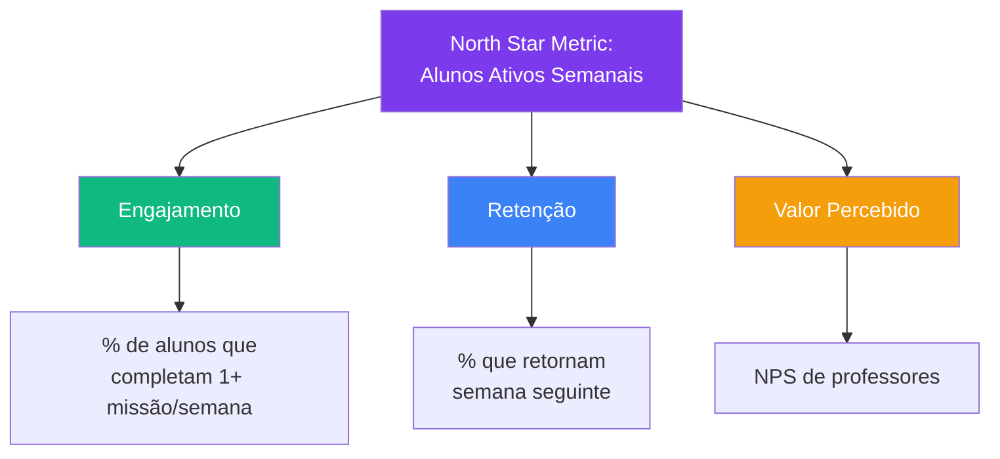
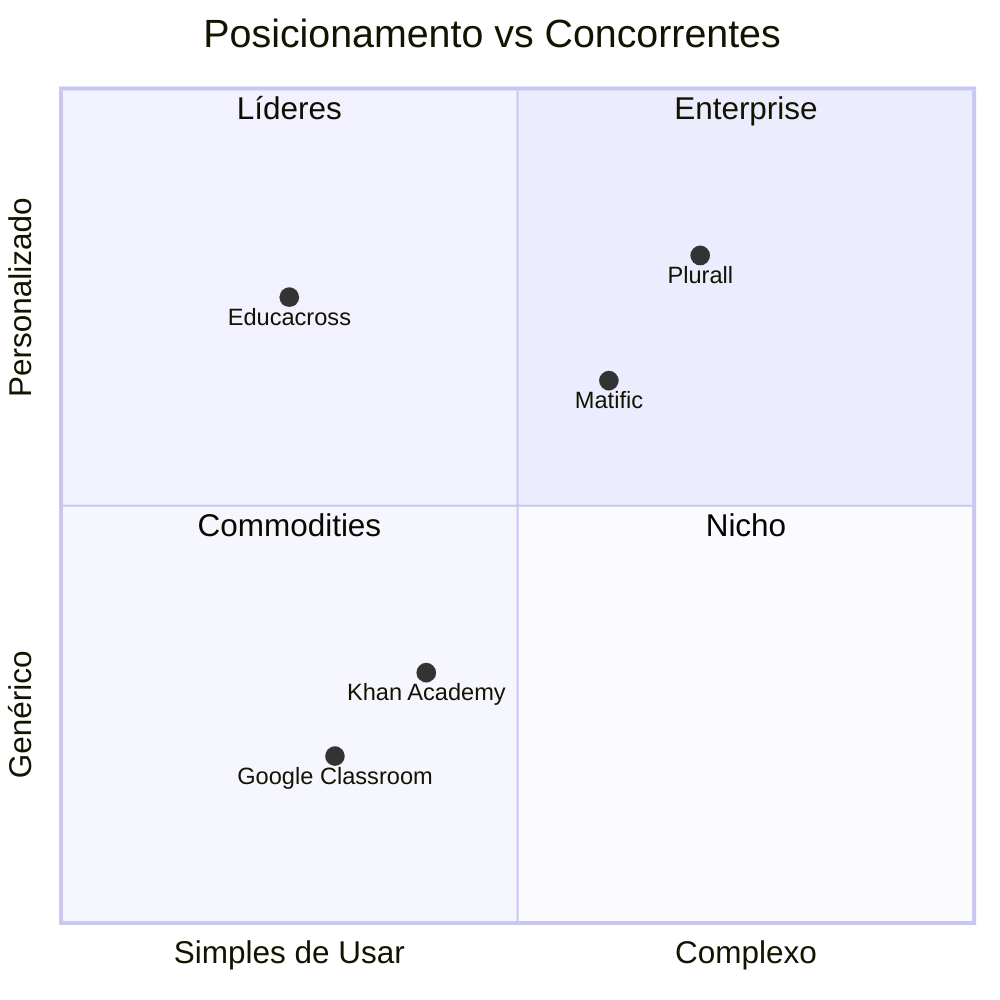

import { IconCheck, IconConstruction, IconTarget, IconRocket, IconChart, IconLightbulb } from '@site/src/components/MaterialIcon';

# Visão e Estratégia de Produto

Este documento define **onde queremos chegar**, **por que existimos** e **como vamos nos diferenciar** no mercado de edtechs.

:::info Documento Vivo
Esta é uma **fonte de verdade** da estratégia de produto. Deve ser revisada a cada trimestre e atualizada conforme evoluímos.
:::

---

## 🎯 Nossa Visão (3-5 anos)

> **"Ser a plataforma educacional mais amada por professores e alunos, transformando o aprendizado em uma jornada gamificada, personalizada e alinhada aos objetivos pedagógicos de cada rede de ensino."**

### O Que Significa na Prática

**Para Professores:**
- ✅ Economizar **5 horas por semana** em planejamento e correção
- ✅ Ter **100% de visibilidade** do progresso de cada aluno
- ✅ Personalizar conteúdos em **menos de 5 minutos**

**Para Alunos:**
- ✅ Engajamento **diário** com atividades gamificadas
- ✅ Aprendizado **autônomo** e no próprio ritmo
- ✅ Feedback **imediato** e reconhecimento por conquistas

**Para Gestores:**
- ✅ Dados consolidados de **toda a rede** em um só lugar
- ✅ Identificação precoce de **alunos em risco**
- ✅ ROI educacional **mensurável**

---

## 🚀 Missão

**Por que existimos:**

> **"Democratizar o acesso a uma educação de qualidade através de tecnologia que empodera professores, engaja alunos e gera resultados mensuráveis."**

### Nossos Valores

| Valor | Significado | Como Aplicamos |
|-------|-------------|----------------|
| **🎓 Pedagogia Primeiro** | Tecnologia serve a pedagogia, não o contrário | Alinhamento 100% com BNCC |
| **🤝 Centrado no Usuário** | Construímos com professores, não para eles | User research contínua |
| **📊 Data-Driven** | Decisões baseadas em dados, não opiniões | Métricas em tudo |
| **⚡ Simplicidade** | Interfaces intuitivas que não requerem treinamento | Onboarding < 5 minutos |
| **🌍 Inclusão** | Acessível mesmo em escolas com baixa conectividade | Offline-first |

---

## 🎯 North Star Metric

**Métrica que guia TODAS as decisões de produto:**

### Por Que Essa Métrica?

| Motivo | Explicação |
|--------|------------|
| **Alinha time inteiro** | Produto, marketing, vendas focam no mesmo objetivo |
| **Mede valor real** | Alunos ativos = produto está gerando valor |
| **Leading indicator** | Prediz retenção e NPS futuros |
| **Acionável** | Podemos influenciar diretamente via features |

**Meta 2026:** 60% dos alunos ativos semanalmente (baseline atual: _TODO - preencher quando tivermos dados_)

---

## 🏆 Posicionamento de Mercado

### Competitive Landscape

### Nossa Diferenciação

| Diferencial | Nós | Concorrente A | Concorrente B |
|-------------|-----|---------------|---------------|
| **Alinhamento BNCC** | ✅ 100% mapeado | ⚠️ Parcial | ❌ Não |
| **Gamificação** | ✅ Nativa | ⚠️ Básica | ✅ Avançada |
| **White-label** | ✅ Total | ❌ Não | ⚠️ Limitado |
| **Offline-first** | ✅ Sim | ❌ Não | ❌ Não |
| **Customização** | ✅ Missões custom | ⚠️ Limitado | ❌ Fixo |
| **Preço** | 💰💰 | 💰💰💰 | 💰 |

### Positioning Statement

> **"Para redes de ensino públicas e privadas que precisam de uma solução completa de engajamento e acompanhamento, o Educacross é a única plataforma que combina gamificação com total alinhamento à BNCC, permitindo que cada rede personalize a experiência visual e pedagógica, mantendo simplicidade de uso mesmo em escolas com internet limitada."**

---

## 🎯 Objetivos Estratégicos (2026)

### 1. Consolidar Liderança em Redes Públicas

**Objetivo:** Ser a plataforma #1 em redes municipais/estaduais

**Iniciativas:**
- ✅ Offline-first architecture
- ✅ Suporte a baixa conectividade
- ✅ Preço competitivo para setor público
- 🔄 Integrações com sistemas de gestão escolar (SGE)

**Métricas de Sucesso:**
- 20+ redes públicas usando o produto
- 100.000+ alunos ativos
- NPS > 50 de coordenadores pedagógicos

---

### 2. Escalar com White-Label

**Objetivo:** Permitir que redes personalizem totalmente a plataforma

**Iniciativas:**
- ✅ White-label visual (cores, logos, domínios)
- 🔄 White-label pedagógico (sistemas de ensino próprios)
- 🔄 Multi-tenant architecture escalável

**Métricas de Sucesso:**
- 5+ redes com white-label ativo
- Tempo de onboarding < 2 semanas
- 0 bugs críticos em deploys de white-label

---

### 3. Expandir para Novos Segmentos

**Objetivo:** Crescer além de ensino fundamental

**Iniciativas:**
- 📋 **TODO:** Validar com pesquisa de mercado
- Possíveis segmentos: Ensino Médio, EJA, Educação Infantil

**Métricas de Sucesso:**
- _TODO: Definir após validação de segmento_

---

## 🧭 Pilares Estratégicos

### Pilar 1: Experiência do Professor

**Tese:** Professores felizes = Alunos engajados

**Apostas:**
1. Dashboard com KPIs acionáveis (não apenas números)
2. Criação de missões custom em < 5 minutos
3. Sugestões de intervenções baseadas em dados

**Anti-padrões:**
- ❌ Complexidade excessiva
- ❌ Muitos cliques para ações simples
- ❌ Relatórios que ninguém entende

---

### Pilar 2: Gamificação que Educa

**Tese:** Gamificação deve reforçar aprendizado, não distrair

**Apostas:**
1. Rankings que celebram progresso, não apenas pontos
2. Missões que exigem raciocínio, não sorte
3. Recompensas alinhadas a conquistas pedagógicas

**Anti-padrões:**
- ❌ Gamificação vazia (pontos sem contexto)
- ❌ Competição que exclui alunos com dificuldade
- ❌ Mecânicas que viciam sem educar

---

### Pilar 3: Dados que Acionam

**Tese:** Dados sem ação são inúteis

**Apostas:**
1. Alertas inteligentes (aluno em risco, baixa participação)
2. Drill-down de habilidades BNCC
3. Comparação contextualizada (turma vs rede)

**Anti-padrões:**
- ❌ Dashboards genéricos
- ❌ Métricas de vaidade
- ❌ Dados sem recomendações

---

## 📊 Métricas de Sucesso da Estratégia

| Categoria | Métrica | Baseline (2025) | Meta 2026 | Status |
|-----------|---------|-----------------|-----------|--------|
| **Adoção** | Alunos ativos (MAU) | _TODO_ | 200.000 | 🔄 |
| **Engajamento** | % alunos ativos semanalmente | _TODO_ | 60% | 🔄 |
| **Retenção** | Churn mensal de redes | _TODO_ | < 5% | 🔄 |
| **Satisfação** | NPS de professores | _TODO_ | > 50 | 🔄 |
| **Eficácia** | % de missões concluídas | 75% | 85% | <IconCheck /> |
| **Performance** | Tempo médio na plataforma | _TODO_ | 15-25min/sessão | 🔄 |

:::warning Métricas a Definir
Seções marcadas com _TODO_ devem ser preenchidas quando implementarmos analytics em produção.
:::

---

## 🚧 O Que NÃO Vamos Fazer (Estratégia de "NO")

| Pedido Comum | Por Que NÃO |
|--------------|-------------|
| **Rede social entre alunos** | Risco de moderação e responsabilidade legal |
| **Videochamadas integradas** | Fora do core, existem soluções melhores (Zoom, Meet) |
| **Venda direta para pais** | Modelo B2B2C é complexo, foco em B2B2B (rede → escola → professor) |
| **Conteúdo não-BNCC** | Dilui nosso diferencial, aumenta manutenção |
| **Mobile app nativo** | PWA resolve 80% dos casos com 20% do esforço |

---

## 🔄 Ciclo de Revisão

Este documento deve ser revisado:

- **Trimestralmente:** Ajuste de métricas e iniciativas
- **Anualmente:** Revisão profunda da visão e posicionamento
- **Eventos especiais:** Pivô estratégico, mudança de mercado, novo concorrente

**Próxima revisão agendada:** 📅 _TODO: Definir data do próximo review_

---

## 🔗 Documentos Relacionados

- [Regras de Negócio](../business-rules/) - Como o produto funciona
- [Personas](../personas/) - Quem são nossos usuários
- [Jornadas](../journeys/) - O que eles fazem no produto
- [Roadmap](../roadmap/) - _TODO: Criar roadmap trimestral_

---

:::tip Contribua
Este documento é colaborativo. Se você tem insights de usuários, pesquisas de mercado ou dados que mudam a estratégia, abra um **Product Decision Record** documentando sua proposta.
:::

---

**Última atualização:** Fevereiro 2026  
**Responsável:** Time de Produto  
**Status:** <IconConstruction /> Em construção (70% completo)
