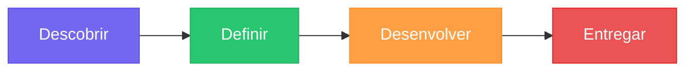
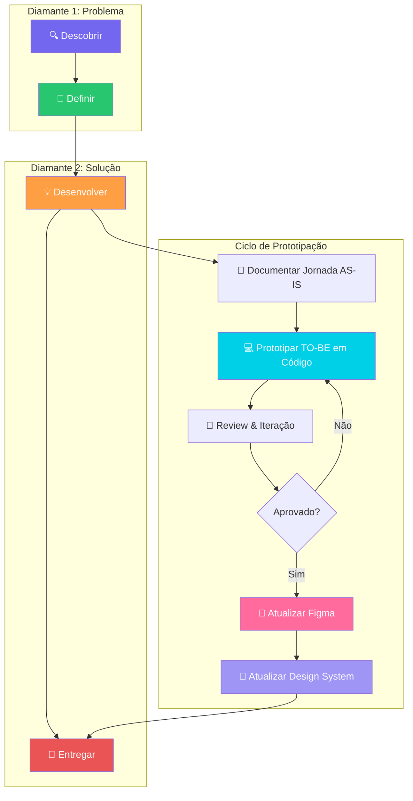
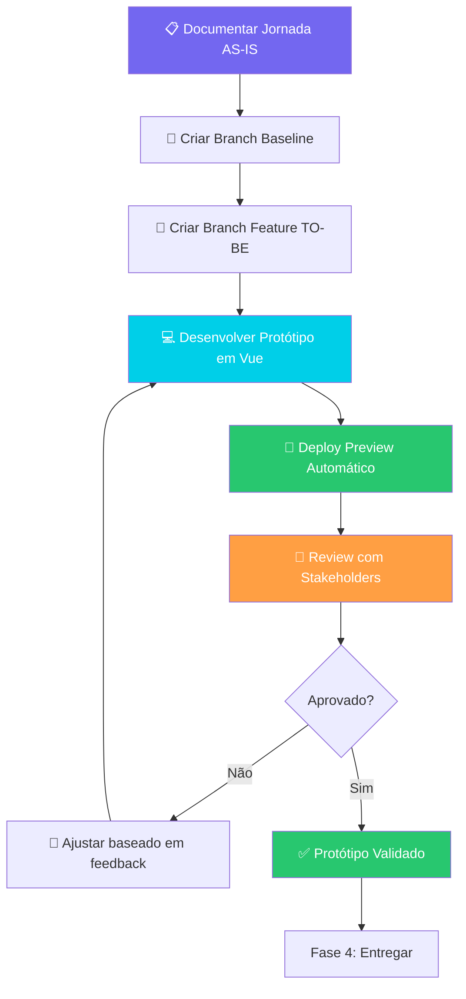
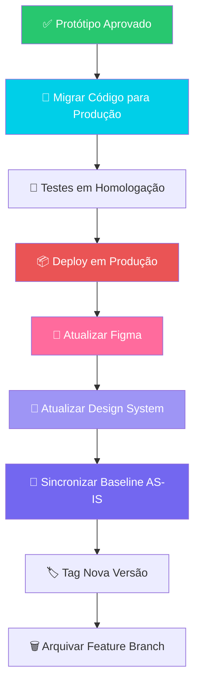

# Processo de Design de Produto

## Visão Geral

Este documento descreve nosso **processo de design de produto** adaptado ao contexto da Educacross, onde utilizamos o conceito do **Double Diamond** (Duplo Diamante) integrado com prototipação em código para facilitar o handoff e manter a consistência entre Figma e Design System.

---

## O Double Diamond Adaptado

O Double Diamond é um framework de design que divide o processo em 4 fases:



### Nossa Adaptação

No contexto da Educacross, **prototipamos com código** desde o início, permitindo:
- ✅ Handoff mais eficiente para desenvolvimento
- ✅ Validação técnica precoce
- ✅ Testes interativos com usuários reais
- ✅ Integração contínua com o Design System

---

## Fluxo Completo do Processo

### Visão Macro



---

## Fase 1: 🔍 Descobrir (Divergir)

**Objetivo**: Entender o problema, necessidades dos usuários e contexto.

### Atividades

| Atividade | Ferramentas | Entregáveis |
|-----------|-------------|-------------|
| Pesquisa com usuários | Entrevistas, observação | Insights e pain points |
| Análise de dados | Analytics, heatmaps | Métricas de comportamento |
| Benchmarking | Análise competitiva | Referências e boas práticas |
| Mapeamento de jornadas | Miro, Figjam | Jornadas AS-IS documentadas |

### Documentação

Todas as descobertas são documentadas em:
- **Docusaurus**: [`docs/discovery/`](/docs/discovery/)
- **Personas**: [`docs/personas/`](/docs/personas/)

### Exemplo: Discovery Professor

```markdown
## Pain Points Identificados

1. **Dificuldade em visualizar progresso dos alunos**
   - Falta de dashboards consolidados
   - Dados espalhados em múltiplas telas

2. **Tempo excessivo para configurar missões**
   - Wizard atual tem 5+ passos
   - Muitos campos obrigatórios
```

---

## Fase 2: 🎯 Definir (Convergir)

**Objetivo**: Sintetizar descobertas e definir o problema a ser resolvido.

### Atividades

| Atividade | Ferramentas | Entregáveis |
|-----------|-------------|-------------|
| Priorização | MoSCoW, RICE score | Backlog priorizado |
| Definição de hipóteses | How Might We (HMW) | Hipóteses validáveis |
| Criação de User Stories | Jira, Linear | Stories detalhadas |
| Critérios de sucesso | OKRs, KPIs | Métricas de validação |

### Documentação

A definição é documentada em:
- **PRDs**: [`docs/prds/`](/docs/prds/)
- **Jornadas**: [`docs/journeys/`](/docs/journeys/)

### Exemplo: Definição do Problema

```markdown
## Problema Prioritário

**Como podemos** reduzir o tempo de configuração de missões customizadas
de 15min para 5min, mantendo a flexibilidade?

### Hipótese

Se simplificarmos o wizard de 5 para 3 passos e pré-popularmos
campos com sugestões inteligentes, então:
- ↓ 60% tempo de configuração
- ↑ 40% missões criadas por professor
```

---

## Fase 3: 💡 Desenvolver (Divergir)

**Objetivo**: Explorar múltiplas soluções através de prototipação em código.

### Nossa Abordagem: Code-First Prototyping

#### Por que prototipar com código?

1. **Handoff eficiente**: Código do protótipo serve de base para produção
2. **Validação técnica**: Detecta limitações técnicas cedo
3. **Testes reais**: Usuários interagem com protótipo funcional
4. **Design System integrado**: Usa componentes reais desde o início

#### Workflow de Prototipação



### Estrutura de Branches Git

Seguimos o workflow documentado em [`PROTOTYPES-WORKFLOW.md`](/PROTOTYPES-WORKFLOW.md):

```bash
prototypes/
├── as-is                          # Baseline que replica produção
│   ├── Tag: as-is-v1.0           # Versão inicial
│   ├── Tag: as-is-v1.1           # Após Education System V2
│   └── Tag: as-is-v1.2           # Após Missions V3
│
└── feature/                       # Protótipos TO-BE
    ├── education-system-v2        # Wizard de livros
    ├── missions-v3                # Timeline de missões
    └── reports-v2                 # Dashboards interativos
```

### Exemplo Prático

#### 1. Criar Baseline AS-IS

```bash
# Documentar estado atual em produção
cd Ambiente_de_Prototipacao_V5/

git checkout -b prototypes/as-is
# Desenvolver réplica do estado atual
npm run dev

git add .
git commit -m "proto: create as-is baseline v1.0"
git tag -a as-is-v1.0 -m "AS-IS Baseline v1.0"
git push origin prototypes/as-is --tags
```

#### 2. Prototipar TO-BE

```bash
# Partir do baseline
git checkout prototypes/as-is
git checkout -b prototypes/feature/missions-v3

# Desenvolver melhorias
npm run dev
# Implementar timeline de missões, filtros avançados, etc.

# Commits incrementais
git add src/views/missions/
git commit -m "proto: add timeline view for missions"
git push origin prototypes/feature/missions-v3
```

#### 3. Deploy Preview Automático

GitHub Actions cria URL de preview:
```
https://missions-v3.prototypes.educacross.dev
```

#### 4. Coleta de Feedback

```markdown
## Feedback Round 1 - Missions V3

### Positivo ✅
- Timeline visual muito mais clara
- Filtros por data funcionando bem

### Melhorar ⚠️
- Adicionar filtro por matéria
- Carregamento lento com muitas missões (>100)

### Próximos Passos
- [ ] Implementar filtro por matéria
- [ ] Adicionar paginação/virtualização
```

---

## Fase 4: 🚀 Entregar (Convergir)

**Objetivo**: Implementar solução em produção e atualizar documentação de design.

### Workflow de Entrega



### 1. Migração para Produção

```bash
# Mudar para repositório de produção
cd educacross-frontoffice/

git checkout develop
git checkout -b feature/EC-1234-missions-v3

# Copiar e adaptar código do protótipo
# - Ajustar imports
# - Integrar APIs reais
# - Adicionar validações
# - Escrever testes

git add .
git commit -m "feat(missions): implement timeline view with filters

JIRA: EC-1234
Prototype: prototypes/feature/missions-v3

Changes:
- Add timeline component
- Add date and subject filters
- Add pagination for 100+ missions
- Add unit and E2E tests

Closes EC-1234"

git push origin feature/EC-1234-missions-v3
# Abrir PR → develop → homolog → master
```

### 2. Atualizar Figma

Após implementação em produção, **atualizamos o Figma** com o design final:

#### Processo

1. **Capturar Screenshots** da implementação real
   ```bash
   # Usar Playwright para screenshots consistentes
   npm run test:e2e:screenshots
   ```

2. **Atualizar Frames no Figma**
   - Projeto: [Educacross Design System](https://figma.com/educacross-ds)
   - Criar nova página: `Missions V3 - Implementation`
   - Importar screenshots de referência
   - Redesenhar componentes baseados no código real

3. **Documentar Componentes**
   ```markdown
   ## Timeline Mission Card

   ### Props
   - `mission`: Object (dados da missão)
   - `onEdit`: Function (callback edição)
   - `onDelete`: Function (callback exclusão)

   ### Variants
   - Default
   - Hover
   - Selected
   - Disabled

   ### Tokens Utilizados
   - Color: `--primary-500`
   - Spacing: `--space-4`
   - Border-radius: `--radius-lg`
   ```

#### Integração Figma → Código

Usamos o **MCP Figma** para sincronização:

```bash
# Extrair tokens do Figma para código
npm run figma:sync-tokens

# Gera: src/design-system/tokens/colors.ts
# Gera: src/design-system/tokens/spacing.ts
# Gera: src/design-system/tokens/typography.ts
```

Ver: [`MCP_FIGMA_QUICKSTART.md`](/MCP_FIGMA_QUICKSTART.md)

### 3. Atualizar Design System

Após Figma atualizado, **sincronizamos o Design System** (Docusaurus):

```bash
cd Ambiente_de_Prototipacao_V5/documentation/

# 1. Adicionar screenshots
cp ../educacross-frontoffice/screenshots/missions-v3-*.png \
   static/img/screenshots/missions/

# 2. Documentar componente
# Criar: docs/design-system/components/timeline-mission-card.md
```

#### Exemplo: Documentação de Componente

```markdown
---
title: Timeline Mission Card
sidebar_position: 12
---

## Visão Geral

Componente de card de missão para visualização em timeline.

## Preview


## Uso

\`\`\`vue
<template>
  <TimelineMissionCard
    :mission="mission"
    @edit="handleEdit"
    @delete="handleDelete"
  />
</template>
\`\`\`

## Props

| Prop | Type | Required | Default | Description |
|------|------|----------|---------|-------------|
| `mission` | `Mission` | ✅ | - | Dados da missão |
| `showActions` | `boolean` | ❌ | `true` | Exibir botões de ação |

## Design Tokens

\`\`\`css
.timeline-mission-card {
  --card-bg: var(--color-surface-primary);
  --card-border: var(--color-border-default);
  --card-shadow: var(--shadow-md);
  --card-padding: var(--space-4);
  --card-radius: var(--radius-lg);
}
\`\`\`

## Figma

[Ver no Figma →](https://figma.com/file/.../timeline-mission-card)
```

### 4. Sincronizar Baseline AS-IS

Após deploy em produção, **atualizamos o baseline** de protótipos:

```bash
cd Ambiente_de_Prototipacao_V5/

git checkout prototypes/as-is
git pull origin prototypes/as-is

# Copiar código final de produção
cp -r ../educacross-frontoffice/src/views/missions/ \
      src/views/missions/

git add .
git commit -m "proto: sync as-is with production v1.2

Migrated from production:
- Missions V3 with timeline view
- Component: TimelineMissionCard.vue
- Integrated: 2026-02-20

Production deploy: master@abc123
Feature branch: feature/EC-1234-missions-v3"

# Atualizar versão
npm version minor  # 1.1.0 → 1.2.0

# Tag nova versão
git tag -a as-is-v1.2 -m "AS-IS Baseline v1.2 - Missions V3"
git push origin prototypes/as-is --tags
```

### 5. Arquivar Feature Branch

```bash
# Deletar branch de protótipo (já migrada)
git branch -d prototypes/feature/missions-v3
git push origin --delete prototypes/feature/missions-v3
```

---

## Ferramentas do Processo

### Stack de Design

| Ferramenta | Uso | Link |
|------------|-----|------|
| **Figma** | Documentação visual pós-implementação | [Educacross DS](https://figma.com/educacross-ds) |
| **Docusaurus** | Design System + Documentação técnica | [`/documentation`](../intro) |
| **Vue 3 + Vite** | Prototipação em código | [`Ambiente_de_Prototipacao_V5`](../../README.md) |
| **Playwright** | Screenshots e validação visual | [`/validation`](../../validation) |
| **MCP Figma** | Sincronização Figma ↔ Código | [`MCP_FIGMA_QUICKSTART.md`](../../MCP_FIGMA_QUICKSTART.md) |

### Stack de Colaboração

| Ferramenta | Uso |
|------------|-----|
| **GitHub** | Versionamento + Deploy preview |
| **Jira** | Gestão de backlog e user stories |
| **Miro** | Workshops e mapeamento de jornadas |
| **Loom** | Vídeos de demonstração de protótipos |

---

## Princípios do Processo

### 1. Code is the Source of Truth

O código implementado é a fonte da verdade. Figma e Design System são **documentados** após implementação, não antes.

**Por quê?**
- Evita divergências entre design e código
- Protótipos validam viabilidade técnica cedo
- Handoff mais eficiente

### 2. Iteração Contínua

Não esperamos "design perfeito" antes de prototipar. Iteramos rapidamente com código.

**Ciclo típico**: 3-5 dias
- Dia 1-2: Protótipo inicial
- Dia 3: Review + Feedback
- Dia 4: Ajustes
- Dia 5: Aprovação

### 3. Documentação Incremental

Documentamos **durante** o processo, não apenas no final.

- Jornadas AS-IS: Durante descoberta
- Protótipos TO-BE: Durante desenvolvimento
- Componentes DS: Após implementação
- Figma: Após deploy em produção

### 4. Design System Vivo

O Design System evolui **com** os protótipos, não antes.


---

## Checklist do Processo

Use esta checklist para garantir que todas as etapas foram seguidas:

### Fase 1: Descobrir

- [ ] Pesquisa com usuários realizada
- [ ] Dados de analytics coletados
- [ ] Jornadas AS-IS mapeadas
- [ ] Personas atualizadas
- [ ] Discovery documentada em `/docs/discovery/`

### Fase 2: Definir

- [ ] Problema prioritário definido
- [ ] Hipóteses formuladas (HMW)
- [ ] User stories criadas no Jira
- [ ] Critérios de sucesso definidos (KPIs)
- [ ] PRD criado em `/docs/prds/`

### Fase 3: Desenvolver (Prototipar)

- [ ] Baseline AS-IS atualizado (`prototypes/as-is`)
- [ ] Feature branch criada (`prototypes/feature/nome`)
- [ ] Protótipo desenvolvido em Vue 3
- [ ] Deploy preview gerado automaticamente
- [ ] Review com stakeholders realizado
- [ ] Feedback documentado e iterado
- [ ] Protótipo aprovado

### Fase 4: Entregar

#### Código
- [ ] Código migrado para `educacross-frontoffice`
- [ ] Testes unitários escritos
- [ ] Testes E2E escritos
- [ ] PR aberta e revisada
- [ ] Deploy em homologação validado
- [ ] Deploy em produção realizado

#### Design
- [ ] Screenshots capturados do código real
- [ ] Figma atualizado com design implementado
- [ ] Componentes documentados no Figma
- [ ] Tokens sincronizados (Figma → Código)

#### Design System
- [ ] Componente documentado em `/docs/design-system/`
- [ ] Screenshots adicionados em `/static/img/screenshots/`
- [ ] Props e variantes documentadas
- [ ] Link para Figma adicionado

#### Baseline
- [ ] Baseline AS-IS atualizado com código de produção
- [ ] Nova tag criada (ex: `as-is-v1.2`)
- [ ] Feature branch arquivada/deletada
- [ ] CHANGELOG atualizado

---

## Métricas de Sucesso do Processo

### Lead Time

Tempo médio da descoberta até produção:

| Complexidade | Target | Média Atual |
|--------------|--------|-------------|
| Pequena (< 5 dias dev) | 2 semanas | 10 dias ✅ |
| Média (5-10 dias dev) | 4 semanas | 3 semanas ✅ |
| Grande (> 10 dias dev) | 8 semanas | 6 semanas ✅ |

### Qualidade

| Métrica | Target | Média Atual |
|---------|--------|-------------|
| Bugs encontrados pós-deploy | < 3 | 2 ✅ |
| Divergência design vs código | < 5% | 3% ✅ |
| Retrabalho após feedback | < 20% | 15% ✅ |

### Eficiência

| Métrica | Target | Média Atual |
|---------|--------|-------------|
| Tempo de handoff (design → dev) | < 1 dia | 0.5 dia ✅ |
| Reuso de componentes DS | > 70% | 75% ✅ |
| Protótipos que vão para produção | > 80% | 85% ✅ |

---

## Referências

### Documentação Interna
- [Workflow de Protótipos](/PROTOTYPES-WORKFLOW.md)
- [Design System](../design-system/integration)
- [Guia de Jornadas](../journeys/)
- [PRD Template](../prds/template)

### Metodologias
- [Double Diamond (Design Council)](https://www.designcouncil.org.uk/our-resources/the-double-diamond/)
- [Jobs to Be Done (JTBD)](https://jtbd.info/)
- [Atomic Design](https://atomicdesign.bradfrost.com/)

### Ferramentas
- [Figma Best Practices](https://www.figma.com/best-practices/)
- [Vue 3 Style Guide](https://vuejs.org/style-guide/)
- [Docusaurus Docs](https://docusaurus.io/)

---

## Perguntas Frequentes

### Por que prototipar com código e não apenas com Figma?

**Resposta**: Código permite validar viabilidade técnica cedo, testar com usuários reais, e facilita handoff. Figma é usado para **documentar** o design final implementado, não para especificar.

### Como garantir que Figma não diverge do código?

**Resposta**: Atualizamos Figma **após** deploy em produção, usando screenshots do código real como referência. Também sincronizamos tokens via MCP Figma.

### E se stakeholder pedir mudanças no meio do desenvolvimento?

**Resposta**: É esperado! Por isso iteramos rapidamente com deploys preview. Cada push gera nova URL para validação.

### Quanto tempo leva um ciclo completo?

**Resposta**: Depende da complexidade:
- Feature pequena: 2 semanas (descoberta → produção)
- Feature média: 4 semanas
- Feature grande: 6-8 semanas

### Como decidimos se um componente vai para o Design System?

**Resposta**: Seguimos regra dos "3 usos":
1. Usado em 1 lugar → componente local
2. Usado em 2 lugares → avaliar reusabilidade
3. Usado em 3+ lugares → promover para Design System

---

**Última atualização**: Fevereiro 2026
**Versão**: 1.0
**Mantido por**: Time de Produto Educacross
