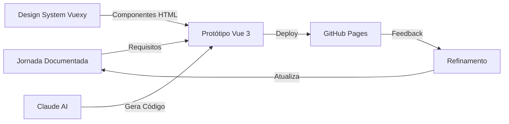

# Protótipos Interativos

Área dedicada aos protótipos funcionais criados com **Vue 3 + Vite** usando o **Design System Vuexy**.

## 🎯 Objetivo

Os protótipos servem para:

1. **Validar** soluções TO-BE propostas nas jornadas
2. **Testar** interações e fluxos com usuários reais
3. **Demonstrar** funcionalidades para stakeholders
4. **Acelerar** desenvolvimento com código reutilizável

## 🏗️ Arquitetura dos Protótipos



### Stack Técnico

- **Framework**: Vue 3.5.24 com Composition API
- **Build Tool**: Vite 7.2.4
- **Router**: Vue Router 4.6.4
- **Design System**: Vuexy (HTML-based)
- **Ícones**: Bootstrap Icons
- **Deploy**: GitHub Pages

## 📂 Estrutura de Arquivos

Todos os protótipos seguem o **padrão DDD (Domain-Driven Design)**:

```
src/views/[contexto]/[feature]/
├── Index.vue           # Orquestrador principal
├── Filters.vue         # Componentes de filtro (se aplicável)
├── List.vue            # Tabela/lista de dados (se aplicável)
├── Title.vue           # Cabeçalho da página (opcional)
├── use[Feature].js     # Composable com lógica de domínio
└── components/         # Componentes específicos da feature
    ├── [Component]Card.vue
    └── [Component]Modal.vue
```

### Exemplo Real: Journey List

```
src/views/
├── Home.vue                    # Landing page
├── JourneyList.vue             # Lista de jornadas (3 colunas)
└── JourneyDetail.vue           # Detalhes da jornada (layout 2 colunas)
```

## 🎨 Usando o Design System

### Paleta de Cores Vuexy

Use as CSS custom properties definidas em `src/style.css`:

```css
--primary: #7367F0    /* Roxo - ações principais */
--success: #28C76F    /* Verde - nível iniciante */
--warning: #FF9F43    /* Laranja - nível intermediário */
--danger: #EA5455     /* Vermelho - nível avançado */
--info: #00CFE8       /* Ciano - informações */
```

### Badges de Nível

Pattern reutilizável para badges de dificuldade:

```javascript
const getBadgeClass = (nivel) => {
  const classes = {
    'Iniciante': 'badge-success',
    'Intermediário': 'badge-warning',
    'Avançado': 'badge-danger'
  }
  return classes[nivel] || 'badge-primary'
}
```

### Importando Componentes do DS

O Design System Vuexy é HTML-based, então você importa o markup:

1. Acesse o [Storybook](https://fabioeducacross.github.io/DesignSystem-Vuexy)
2. Encontre o componente desejado
3. Copie o HTML do componente
4. Cole no template Vue e adapte com `v-bind`, `v-for`, etc.

**Exemplo: Card do DS**

```vue
<template>
  <div class="card">
    <div class="card-header">
      <h4 class="card-title">{{ title }}</h4>
    </div>
    <div class="card-body">
      {{ content }}
    </div>
    <div class="card-footer">
      <button class="btn btn-primary">Ação</button>
    </div>
  </div>
</template>
```

## 🚀 Criando um Novo Protótipo

### 1. Definir a Jornada

Antes de criar um protótipo, certifique-se de que a jornada está documentada em `/docs/journeys/`.

### 2. Criar Estrutura de Arquivos

```bash
mkdir -p src/views/[contexto]/[feature]
touch src/views/[contexto]/[feature]/Index.vue
touch src/views/[contexto]/[feature]/use[Feature].js
```

### 3. Criar Rota

Adicione a rota em `src/router/index.js`:

```javascript
{
  path: '/[path]',
  name: '[RouteName]',
  component: () => import('@/views/[contexto]/[feature]/Index.vue')
}
```

### 4. Implementar Componente

**Index.vue** (Orquestrador):

```vue
<script setup>
import { ref } from 'vue'
import use[Feature] from './use[Feature]'

const { data, loading, fetchData } = use[Feature]()

// Lifecycle
onMounted(() => {
  fetchData()
})
</script>

<template>
  <div class="container">
    <h1>Título da Feature</h1>
    <div v-if="loading">Carregando...</div>
    <div v-else>
      <!-- Conteúdo -->
    </div>
  </div>
</template>

<style scoped>
/* Estilos com escopo */
</style>
```

**use[Feature].js** (Composable):

```javascript
import { ref } from 'vue'
import journeysData from '@/data/journeys.json'

export default function use[Feature]() {
  const data = ref([])
  const loading = ref(false)

  const fetchData = () => {
    loading.value = true
    // Simular API call com JSON local
    setTimeout(() => {
      data.value = journeysData
      loading.value = false
    }, 500)
  }

  return {
    data,
    loading,
    fetchData
  }
}
```

### 5. Adicionar Dados (se necessário)

Dados estáticos ficam em `src/data/journeys.json`:

```json
[
  {
    "id": 1,
    "titulo": "Nome da Jornada",
    "descricao": "Descrição...",
    "categoria": "Categoria",
    "nivel": "Iniciante",
    "status": "ativo"
  }
]
```

### 6. Testar Localmente

```bash
npm run dev
```

Acesse: http://localhost:5173/[path]

### 7. Deploy (Opcional)

```bash
npm run build
```

Os arquivos de build ficam em `dist/` prontos para deploy.

## 🤖 Workflow com Claude AI

Como designer vibecoder, você trabalha assim com Claude:

### 1. Descrever a Funcionalidade

```
"Preciso de uma página que lista jornadas educacionais em cards.
Cada card deve mostrar título, descrição, nível de dificuldade 
(com badge colorido: verde=iniciante, laranja=intermediário, 
vermelho=avançado) e duração. Os cards devem ter hover effect 
com shadow. Layout responsivo de 3 colunas no desktop."
```

### 2. Claude Gera o Código

Claude criará automaticamente:
- Componente Vue 3 com `<script setup>`
- Template HTML usando classes Vuexy
- Estilos scoped
- Lógica de dados

### 3. Revisar Visualmente

Copie o código, execute `npm run dev`, e veja no navegador.

### 4. Iterar

Se precisa ajustes, descreva para o Claude:

```
"O espaçamento entre os cards está muito pequeno. 
Aumenta para 24px e adiciona um gradiente roxo no hover."
```

## 📋 Checklist de Qualidade

Antes de considerar um protótipo completo:

- [ ] Componente segue estrutura DDD (Index.vue + composable)
- [ ] Usa cores do Design System Vuexy
- [ ] Template é responsivo (mobile, tablet, desktop)
- [ ] Código usa Composition API com `<script setup>`
- [ ] Estilos são scoped para evitar conflitos
- [ ] Lógica de negócio está no composable, não no componente
- [ ] Dados vêm de `src/data/` (não hardcoded)
- [ ] Componente está documentado em JSDoc

## 🔗 Links Úteis

- [Design System Storybook](https://fabioeducacross.github.io/DesignSystem-Vuexy) - Catálogo de componentes
- [Vue 3 Docs](https://vuejs.org/) - Documentação oficial
- [Composition API](https://vuejs.org/guide/extras/composition-api-faq.html) - Guia da Composition API
- [Bootstrap Icons](https://icons.getbootstrap.com/) - Ícones disponíveis

## 📊 Protótipos Existentes

### 1. Journey List

**Jornada**: Catálogo de Jornadas  
**Rota**: `/journeys`  
**Arquivo**: `src/views/JourneyList.vue`  
**Features**:
- Grid 3 colunas responsivo
- Cards com hover effect
- Badges de nível coloridos
- Botão "Ver Detalhes"

### 2. Journey Detail

**Jornada**: Visualizar Detalhes da Jornada  
**Rota**: `/journey/:id`  
**Arquivo**: `src/views/JourneyDetail.vue`  
**Features**:
- Layout 2 colunas (8/4)
- Sidebar sticky com info
- Lista de módulos
- Gradiente Vuexy

### 3. Home (Landing Page)

**Jornada**: Entrada no Ambiente  
**Rota**: `/`  
**Arquivo**: `src/views/Home.vue`  
**Features**:
- Hero section com gradiente
- Cards de features
- Call-to-action

## 🆕 Próximos Protótipos

Baseado nas jornadas prioritárias:

1. **Login e Autenticação** (PROF-001)
2. **Dashboard Professor** (PROF-002)
3. **Livros do Sistema Educacional** (PROF-003)
4. **Missões e Exercícios** (ALUNO-001)
5. **Criar Avaliação** (PROF-004)

## 💬 Suporte

Dúvidas sobre protótipos?

- Consulte o [guia de configuração](/docs/getting-started/setup)
- Veja o [template de jornada](/docs/templates/journey-template)
- Acesse as [Copilot instructions](https://github.com/fabioeducacross/Ambiente_de_Prototipacao_V5/blob/main/.github/copilot-instructions.md)
