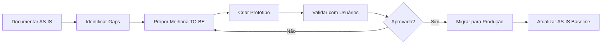

# Protótipos TO-BE 🚀

Documentação dos protótipos de melhorias propostas.

## Visão Geral

Esta seção contém **protótipos interativos** de melhorias nas jornadas existentes. Cada protótipo parte do baseline AS-IS e propõe evoluções na experiência de usuário.

## Metodologia

### Workflow de Prototipação



### Branches Git

Cada protótipo tem sua própria branch:

- **Base**: `prototypes/as-is` (baseline)
- **Feature**: `prototypes/feature/nome-da-melhoria`
- **Deploy**: Preview automático no Vercel

## Protótipos Planejados

### 🔴 Alta Prioridade

#### 1. Education System V2

**Status**: 📋 Planejado  
**Jornada Base**: [PROF-001: Books](../journeys/teacher/education-system-books.md)  
**Branch**: `prototypes/feature/education-system-v2`

**Melhorias Propostas**:
- ✨ Wizard de seleção de livros (passo-a-passo)
- 🔍 Preview interativo de páginas antes de abrir
- ⭐ Sistema de favoritos
- 📚 Histórico de últimos livros acessados
- 🔎 Busca avançada por capítulo/conteúdo

**Componentes Novos**:
- `DSBookSelector.vue` - Wizard de seleção
- `DSBookPreview.vue` - Preview interativo
- `DSBookHistory.vue` - Histórico

**Deploy Preview**: [Será criado após implementação]

---

#### 2. Missions V3

**Status**: 📋 Planejado  
**Jornada Base**: [PROF-002: Missions](../journeys/teacher/education-system-missions.md)  
**Branch**: `prototypes/feature/missions-v3`

**Melhorias Propostas**:
- 📊 Visualização em sequência/timeline
- ☑️ Seleção múltipla com checkboxes
- ⚡ Ações em lote melhoradas
- 🎯 Preview de questões antes de habilitar
- 📈 Dashboard de uso

**Componentes Novos**:
- `DSMissionTimeline.vue` - Visualização sequencial
- `DSMissionPreview.vue` - Preview de questões
- `DSBatchActions.vue` - Ações em lote

**Deploy Preview**: [Será criado após implementação]

---

### 🟡 Média Prioridade

#### 3. Custom Missions Editor V2

**Status**: 💡 Ideação  
**Jornada Base**: PROF-003: Custom Missions  
**Branch**: `prototypes/feature/missions-editor-v2`

**Melhorias Propostas**:
- 🎨 Editor WYSIWYG para questões
- 📸 Upload de imagens drag-and-drop
- 🎬 Suporte a vídeos e áudio
- 🧩 Banco de questões reutilizáveis
- 🤖 Sugestões de IA

---

#### 4. Reports Dashboard V2

**Status**: 💡 Ideação  
**Jornada Base**: ADMIN-001: Mission Reports  
**Branch**: `prototypes/feature/reports-v2`

**Melhorias Propostas**:
- 📊 Dashboards interativos com drill-down
- 📈 Gráficos comparativos
- 📥 Exportação em múltiplos formatos
- 🔔 Alertas automáticos
- 📱 Versão mobile otimizada

---

## Como Usar

### Para Stakeholders

1. **Acesse o Deploy Preview** - URL disponível após implementação
2. **Teste Interativamente** - Navegue pelo protótipo
3. **Forneça Feedback** - Use GitHub Issues ou formulário
4. **Aprove/Rejeite** - Decisão registrada no PR

### Para Desenvolvedores

1. **Clone o Repositório**
   ```bash
   git clone https://github.com/fabioeducacross/Ambiente_de_Prototipacao_V5.git
   cd Ambiente_de_Prototipacao_V5
   ```

2. **Checkout do Protótipo**
   ```bash
   git checkout prototypes/feature/education-system-v2
   npm install
   npm run dev
   ```

3. **Desenvolva Localmente**
   - Acesse `http://localhost:5173`
   - Hot-reload habilitado
   - Design System integrado via MCP

### Para Designers

1. **Revise Screenshots** - Antes/depois comparação
2. **Valide Componentes** - Links para Storybook
3. **Teste Usabilidade** - Fluxos interativos
4. **Sugira Ajustes** - Via GitHub Issues

---

## Critérios de Aprovação

Para um protótipo ser aprovado e migrado para produção:

- ✅ **Usabilidade**: Testado com 5+ usuários reais
- ✅ **Performance**: Lighthouse score >90
- ✅ **Acessibilidade**: WCAG 2.1 Level AA
- ✅ **Design System**: 100% componentes do DS
- ✅ **Responsivo**: Mobile + Tablet + Desktop
- ✅ **Testes**: Cobertura >80%

---

## Histórico de Protótipos

### Aprovados e Implementados

Nenhum protótipo implementado ainda.

### Em Análise

Nenhum protótipo em análise ainda.

### Rejeitados

Nenhum protótipo rejeitado ainda.

---

## Próximos Passos

1. **Fase 4 (Semana 5)**: Criar baseline AS-IS
   - Aguardar MCP do Design System
   - Replicar 4 jornadas documentadas
   - Deploy em `prototypes-as-is.vercel.app`

2. **Fase 5 (Semana 6-8)**: Desenvolver Protótipos TO-BE
   - Education System V2
   - Missions V3
   - Coletar feedback
   - Iterar baseado em feedback

3. **Fase 6 (Semana 9-10)**: Migrar para Produção
   - Implementar em educacross-frontoffice
   - Testes de QA
   - Deploy para produção
   - Atualizar baseline AS-IS

---

**Última Atualização**: 3 de fevereiro de 2026  
**Protótipos Planejados**: 4  
**Protótipos Implementados**: 0  
**Protótipos Aprovados**: 0
