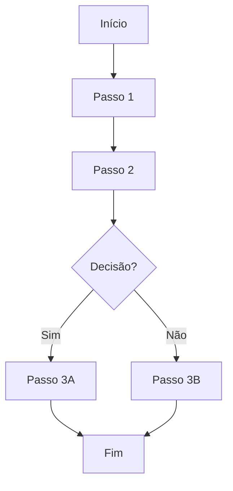
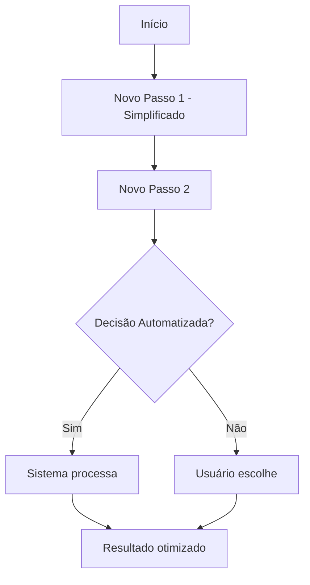

import { IconLink, IconPalette, IconSparkle } from '@site/src/components/MaterialIcon';


import { IconClipboard, IconTarget, IconCheck, IconChart } from '@site/src/components/StatusIcons';

# Template de Documentação de Jornada

Use este template para documentar novas jornadas de usuário no sistema Educacross.

:::tip Como Usar
1. Copie este arquivo para `docs/journeys/[contexto]/[nome-da-jornada].md`
2. Substitua os placeholders `[CAMPO]` com informações reais
3. Remova esta seção de instruções
4. Adicione link no índice de jornadas
:::

---

## <IconClipboard size={20} /> Informações Básicas

| Campo | Valor |
|-------|-------|
| **ID da Jornada** | `[SIGLA-CONTEXTO]-[NUMERO]` (ex: PROF-001, ALUNO-003) |
| **Título** | [Nome descritivo da jornada] |
| **Contexto** | [Professor / Aluno / Admin / Network Manager / Auditor / Responsável] |
| **Persona** | [Nome da persona principal] |
| **Prioridade** | [Alta / Média / Baixa] |
| **Status** | [Em Análise / Documentado / Prototipado / Implementado] |
| **Última Atualização** | [YYYY-MM-DD] |

## <IconTarget size={20} /> Objetivo da Jornada

[Descreva em 2-3 parágrafos qual é o objetivo principal desta jornada e por que é importante para o usuário]

**O que o usuário quer alcançar:**
- [Objetivo 1]
- [Objetivo 2]
- [Objetivo 3]

## <span class="material-symbols-outlined">person</span> Persona

**Nome**: [Nome da Persona]  
**Papel**: [Papel no sistema]  
**Contexto**: [Contexto de uso]  
**Experiência**: [Nível de experiência com tecnologia]

**Necessidades:**
- [Necessidade 1]
- [Necessidade 2]
- [Necessidade 3]

## <span class="material-symbols-outlined">location_on</span> Contexto de Entrada

**Pré-condições:**
- [Condição necessária antes de iniciar a jornada]
- [Outra condição]

**Ponto de entrada:**
- [De onde o usuário acessa esta jornada]
- [Link, menu, botão, etc.]

## <span class="material-symbols-outlined">map</span> Fluxo AS-IS (Estado Atual)

### Diagrama de Fluxo



### Passos Detalhados

1. **[Nome do Passo 1]**
   - Descrição: [O que acontece neste passo]
   - Tela: [Nome da tela/componente]
   - Ações: [Ações que o usuário realiza]
   - Sistema: [O que o sistema faz]

2. **[Nome do Passo 2]**
   - Descrição: [O que acontece neste passo]
   - Tela: [Nome da tela/componente]
   - Ações: [Ações que o usuário realiza]
   - Sistema: [O que o sistema faz]

3. **[Continuar...]**

### Telas do Fluxo Atual

**Tela 1: [Nome da Tela]**
- Componente: `[src/views/path/Component.vue]`
- Rota: `[/route/path]`
- Screenshot: [Adicionar imagem se disponível]

**Tela 2: [Nome da Tela]**
- Componente: `[src/views/path/Component.vue]`
- Rota: `[/route/path]`
- Screenshot: [Adicionar imagem se disponível]

## <span class="material-symbols-outlined">sentiment_dissatisfied</span> Pontos de Dor (Pain Points)

### 1. [Título do Ponto de Dor 1]
- **Descrição**: [Descreva o problema]
- **Impacto**: [Alto / Médio / Baixo]
- **Frequência**: [Sempre / Frequente / Ocasional]
- **Evidência**: [Feedback de usuários, tickets, observações]
- **Citação do usuário**: _"[Quote real ou sintético]"_

### 2. [Título do Ponto de Dor 2]
- **Descrição**: [Descreva o problema]
- **Impacto**: [Alto / Médio / Baixo]
- **Frequência**: [Sempre / Frequente / Ocasional]
- **Evidência**: [Feedback de usuários, tickets, observações]
- **Citação do usuário**: _"[Quote real ou sintético]"_

### 3. [Continuar...]

### Métricas do Problema

| Métrica | Valor Atual | Objetivo |
|---------|-------------|----------|
| Tempo médio de conclusão | [X minutos] | [Y minutos] |
| Taxa de erro/abandono | [X%] | [Y%] |
| Tickets de suporte | [X/mês] | [Y/mês] |
| NPS da funcionalidade | [X] | [Y] |

## <IconSparkle /> Proposta TO-BE (Estado Futuro)

### Visão Geral da Solução

[Descreva em 2-3 parágrafos a solução proposta e como ela resolve os pontos de dor]

### Principais Mudanças

1. **[Mudança 1]**
   - **Como é hoje**: [Descrição]
   - **Como será**: [Descrição]
   - **Benefício**: [Benefício para o usuário]

2. **[Mudança 2]**
   - **Como é hoje**: [Descrição]
   - **Como será**: [Descrição]
   - **Benefício**: [Benefício para o usuário]

3. **[Continuar...]**

### Diagrama de Fluxo TO-BE



### Wireframes/Mockups

**Tela 1: [Nome da Nova Tela]**
```
┌─────────────────────────────────────┐
│ [Cabeçalho]                         │
├─────────────────────────────────────┤
│ [Conteúdo Principal]                │
│                                     │
│ [Componente 1]  [Componente 2]      │
│                                     │
├─────────────────────────────────────┤
│ [Ações: Botões]                     │
└─────────────────────────────────────┘
```

**Tela 2: [Nome da Nova Tela]**
[Adicionar mockup ou wireframe]

### Componentes do Design System

Componentes Vuexy que serão utilizados:

- **[Componente 1]**: [Nome no Storybook]
  - Link: [URL do Storybook]
  - Uso: [Como será usado]

- **[Componente 2]**: [Nome no Storybook]
  - Link: [URL do Storybook]
  - Uso: [Como será usado]

## <IconPalette /> Implementação

### Arquitetura Técnica

**Estrutura de arquivos:**
```
src/views/[contexto]/[feature]/
├── Index.vue           # Orquestrador
├── Filters.vue         # Filtros (se houver)
├── List.vue            # Tabela/lista (se houver)
└── use[Feature].js     # Composable domain
```

**Rotas:**
```javascript
{
  path: '/[path]',
  name: '[RouteName]',
  component: () => import('@/views/[context]/[Feature]/Index.vue'),
  meta: {
    resource: '[Resource]',
    action: 'read'
  }
}
```

### APIs Necessárias

| Endpoint | Método | Descrição |
|----------|--------|-----------|
| `/api/[endpoint]` | GET | [Descrição] |
| `/api/[endpoint]` | POST | [Descrição] |
| `/api/[endpoint]/:id` | PUT | [Descrição] |

### Estado Global (Vuex)

**Módulo**: `src/store/pageModules/[module-name].js`

**State:**
```javascript
{
  data: [],
  loading: false,
  filters: {}
}
```

**Actions:**
- `fetch[Data]()` - [Descrição]
- `update[Item]()` - [Descrição]

### Composable Domain

**Arquivo**: `src/views/[context]/[feature]/use[Feature].js`

**Interface:**
```javascript
export default function use[Feature]() {
  return {
    moduleName,
    data,
    loading,
    fetch[Data],
    update[Item]
  }
}
```

## <IconCheck size={20} /> Critérios de Aceite

### Funcionalidades Obrigatórias

- [ ] [Critério 1]
- [ ] [Critério 2]
- [ ] [Critério 3]

### Requisitos Não-Funcionais

- [ ] Tempo de carregamento < [X] segundos
- [ ] Responsivo (mobile/tablet/desktop)
- [ ] Acessível (WCAG 2.1 AA)
- [ ] Compatível com navegadores (Chrome, Firefox, Safari, Edge)

### Testes

- [ ] Testes unitários dos componentes
- [ ] Testes de integração da jornada
- [ ] Testes de acessibilidade
- [ ] Testes de performance

## <IconChart size={20} /> Métricas de Sucesso

| Métrica | Baseline | Meta | Medição |
|---------|----------|------|---------|
| Tempo de conclusão | [X min] | [Y min] | Google Analytics |
| Taxa de sucesso | [X%] | [Y%] | Tracking events |
| Satisfação do usuário | [X/10] | [Y/10] | NPS survey |
| Taxa de erro | [X%] | [Y%] | Error tracking |

## <IconLink /> Referências

### Documentação Relacionada

- [Link para outra jornada relacionada]
- [Link para documentação técnica]
- [Link para design system]

### Recursos Externos

- [Pesquisa de usuário]
- [Análise de concorrentes]
- [Feedback de usuários]

### Código Fonte

**Protótipo**: `src/views/[path]/[Component].vue`  
**Referência AS-IS**: `educacross-frontoffice/src/views/pages/[context]/[path]`

## <span class="material-symbols-outlined">calendar_today</span> Histórico de Mudanças

| Data | Versão | Autor | Mudanças |
|------|--------|-------|----------|
| YYYY-MM-DD | 1.0 | [Nome] | Criação inicial |
| YYYY-MM-DD | 1.1 | [Nome] | [Descrição das mudanças] |

---

## <span class="material-symbols-outlined">chat</span> Comentários e Notas

[Espaço para observações, perguntas pendentes, decisões a serem tomadas, etc.]
