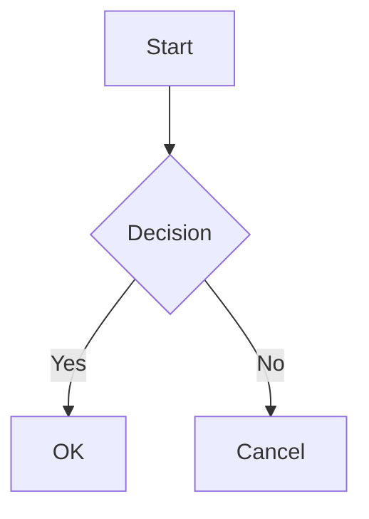
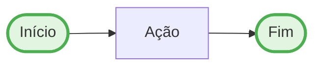

# Teste Mermaid

Este é um teste simples para verificar se o Mermaid está renderizando.

## Diagrama Simples

```mermaid
graph TD
    A[Start] --> B{Decision}
    B -->|Yes| C[OK]
    B -->|No| D[Cancel]
```

## Diagrama Com Cores

```mermaid
graph LR
    Start([Início]) --> Action[Ação]
    Action --> End([Fim])
    
    classDef green fill:#e1f5e1,stroke:#4caf50,stroke-width:3px
    class Start,End green
```
